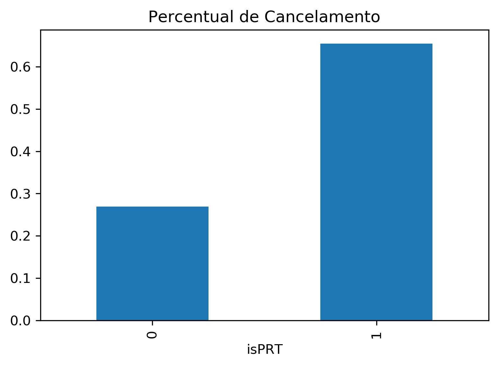

# Classificação: uma reserva de hotel será cancelada?
Esse é um projeto completo de data science: obtenção dos dados, tratamento de missing data, análise exploratória de dados, modelagem, otimização dos hiperparâmetros, explicabilidade e deploy do modelo no Google Cloud Platform.

Nessa página você encontra um resumo do projeto. A versão completa está separada nos arquivos [missing_data.ipynb](missing_data.ipynb), [EDA.ipynb](EDA.ipynb), [modeling.ipynb](modeling.ipynb), [explainability.ipynb](explainability.ipynb).

## Resumo do Projeto
* Objetivo: criar um modelo de previsão da probabilidade de uma reserva de hotel ser cancelada.
* Nosso modelo xgboost final alcançou um recall de 92% em data points nunca vistos por ele.
* Dados: 80 mil reservas de um hotel situado em Lisboa, Portugal.
* Análise exploratória de dados mostrou que a renda é o fator mais relevante para a previsão da nota.
* Feature engineering: criei duas features novas: uma que indica a renda per capita (por residente no domicílio) do candidato e outra que indica a escolaridade máxima entre pai e mãe.
* Benchmark model com XGBoost e LightGBM para análise de importâncias relativas entre features e feature selection.
* Refinamento do modelo: procura por hiperparâmetros ótimos usando bayesian search.
* Interpretação do modelo: expliquei quais são as decisões que o modelo faz para chegar a uma previsão. Para isso, usei valores SHAP.
* Deploy serverless do modelo no [AWS Lambda](https://aws.amazon.com/lambda/) e criação de um [bot do Telegram](https://telegram.org/blog/bot-revolution) que permite que qualquer pessoa faça a previsão da sua nota no ENEM usando nosso modelo.

## Recursos utilizados
**Python**: Versão 3.7 
**Pacotes Python**: numpy, pandas, matplotlib, seaborn, xgboost, hyperopt, joblib, shap 
**Serverless framework para deploy no AWS Lambda**: https://www.serverless.com/ 
**Bayesian optimization**: [[1]](https://towardsdatascience.com/automated-machine-learning-hyperparameter-tuning-in-python-dfda59b72f8a) [[2]](https://docs.aws.amazon.com/sagemaker/latest/dg/automatic-model-tuning-ex.html) 
**Explicando o modelo com SHAP**: [[1]](https://medium.com/@gabrieltseng/interpreting-complex-models-with-shap-values-1c187db6ec83) [[2]](https://towardsdatascience.com/shap-explained-the-way-i-wish-someone-explained-it-to-me-ab81cc69ef30) [[3]](https://towardsdatascience.com/black-box-models-are-actually-more-explainable-than-a-logistic-regression-f263c22795d) [[4]](https://towardsdatascience.com/explain-your-model-with-the-shap-values-bc36aac4de3d)

## Obtenção dos dados
Os dados foram disponibilizados no artigo [Hotel booking demand datasets](https://www.sciencedirect.com/science/article/pii/S2352340918315191) e coletados [aqui](https://github.com/rfordatascience/tidytuesday/tree/master/data/2020/2020-02-11). São cerca de 80 mil reservas feitas num hotel situado na cidade de Lisboa, Portugal, entre os anos de 2015 e 2017.

Exemplos de features disponíveis:
|variable                       |class     |description |
|:------------------------------|:---------|:-----------|
|is_canceled                    |double    | Value indicating if the booking was canceled (1) or not (0) |
|lead_time                      |double    | Number of days that elapsed between the entering date of the booking into the PMS and the arrival date |
|adults                         |double    | Number of adults|
|children                       |double    | Number of children|
|country                        |character | Country of origin. Categories are represented in the ISO 3155–3:2013 format |
|is_repeated_guest              |double    | Value indicating if the booking name was from a repeated guest (1) or not (0) |
|reserved_room_type             |character | Code of room type reserved. Code is presented instead of designation for anonymity reasons |
|adr                            |double    | Average Daily Rate as defined by dividing the sum of all lodging transactions by the total number of staying nights |
|total_of_special_requests      |double    | Number of special requests made by the customer (e.g. twin bed or high floor)|

fonte: adaptado do [repo](https://github.com/rfordatascience/tidytuesday/tree/master/data/2020/2020-02-11).

A variável in_canceled informa se a reserva foi cancelada (in_canceled = 1) ou não (in_canceled = 0). Essa é a variável dependente, aquela que queremos que nosso modelo preveja.

## Data Cleaning (tratando missing data)
Após carregar os dados, precisei fazer uma série de transformações para que ficassem apropriados para serem utilizados no treinamento dos modelos. Confira a etapa completa em [missing_data.ipynb](missing_data.ipynb).
* Removi cerca de 30 data points continham campos nulos na coluna Country.
* Removi a coluna Company, que possuía mais de 90% de missing data.
* Removi 324 reservas que possuíam duração de hospedagem de 0 dias.
* Removi 99 reservas que tinham 0 pessoas associadas (nenhum adulto, criança ou bebê).
* Transformei o Data type de features categóricas de string para número inteiro.

## Análise Exploratória de Dados e Feature Engineering
* Após o tratamento de missing data, ficamos com 78879 data points.
* A proporção de cancelamentos era maior em reservas feitas por clientes de Portugal.
* A proporção de cancelamentos era menor em reservas feitas por clientes da União Europeia que não de Portugal.
* As duas informações acima me levaram a fazer 2 Feature Engineering: **isPRT**: a reserva foi feita por um cliente de Portugal? **isEU**: a reserva foi feita por um cliente da união Europeia?
* 40% das reservas possuíam algum tipo de pedido especial, e tinham uma taxa de cancelamento 2.5x menor que reservas sem nenhum pedido especial.
* Reservas que possuíam apenas dias de final de semana tinham uma taxa de cancelamento menor
* A informação acima me levou a criar a seguinte feature: **isOnlyWeekend**: a reserva possui apenas dias de final de semana?

Muitas outras features pareceram ser relevantes para a previsão da probabilidade de cancelamento. A análise completa está no arquivo [EDA.ipynb](EDA.ipynb).

## Data Leakage

## Benchmark e Refinamento do modelo
Treinei dois modelos com hiperparâmetros default: um xgboost e um lightgbm, que apresentaram RMSE similares (~93 no conjunto de validação). A partir desses dois modelos, analisei as feature importances e discuti inconsistências existentes quando mudamos o critério para determinação das feature importances. A solução foi usar a média dos módulos dos valores SHAP para definir que features eram mais importantes. A partir desse resultado, realizei a feature selection. O model final acabou ficando com apenas 5 features.

## Refinamento do modelo
Decidi continuar a modelagem apenas com o lighgbm. Isso porque apresentou um benchmark muito parecido com o xgboost, é treinado mais rapidamente e evitaria [problemas](https://medium.com/@AlexeyButyrev/xgboost-on-aws-lambda-345f1394c2b) no deploy no AWS Lambda.

Utilizei a técnica de busca bayesiana para procurar os hiperparâmetros ótimos, com a implementação do pacote [hyperopt](https://github.com/hyperopt/hyperopt).

Após 500 rounds de busca bayesiana, o modelo final mostrou RMSE de ~ 93 pontos no conjunto de teste (pontos nunca vistos antes pelo modelo, nem como validação).

## Interpretação do modelo
Para explicar quais são as decisões que o modelo toma para chegar às previsões, utilizei os valores SHAP, com a implementação da biblioteca [shap](https://github.com/slundberg/shap). Seguem alguns dos insights percebidos.

#### Impacto das features na previsão do modelo
O gráfico abaixo dá uma visão geral das decisões que nosso modelo faz para chegar à previsão de um usuário. Cada linha representa uma feature diferente e deve ser lida separadamente.

A primeira linha, da renda (Q006), mostra que, dentro dos candidatos das menores classes de renda (em azul), temos dois efeitos distintos. A maior parte deles tem um grande prejuízo na previsão da nota por conta de sua classe de renda (cluster centrado no valor de SHAP de -30). Mas existe outro cluster, de menor tamanho, centrado perto de SHAP zero. Para esse segundo cluster, o fator renda não tem grande impacto na previsão da nota. É provável que seja contrabalenceado por outro fator que não incluso no modelo (possivelmente alguma coisa relacionada à motivação ou dedicação que o aluno dá aos estudos, devido à diferenças culturais ou de estímulos familiares, fator que não é contemplado por nosso modelo).

A segunda linha mostra que quando o candidato é mulher (vermelho, pois TP_SEXO = 1 para mulheres) a previsão de nota é menor do que para homens. Essa queda na previsão da nota devida ao fator "sexo" é bastante consistente entre os candidatos, como podemos observar pelos dois cluster de pequena variância.

A terceira linha aponta que quando a escolaridade dos pais é baixa (em azul), o prejuízo na previsão da nota prevista por nosso modelo é variado. Há alunos com relativamente pouco prejuízo (SHAP pouco negativo) e outros com muito prejuízo (SHAP muito negativo). Já para alta escolaridade, o benefício na nota é mais consistente (cluster com pequena variância).

#### O efeito do sexo sobre a previsão do modelo, e sua interação com a renda
O gráfico abaixo mostra que quando o candidato é mulher (TP_SEXO = 1), o valor de SHAP é negativo (entre -10 e -25, aproximadamente). Como já havíamos percebido, nosso modelo dá uma previsão de nota menor quando o candidato é mulher.

Podemos, contudo, observar um efeito curioso. A queda da nota devido ao fator "sexo" para mulheres é mais acentuada quando as candidatas são das maiores classes de renda: os pontos de cor vermelha (alta renda), para as mulheres, estão mais abaixo do que os de cor azulada (baixa renda). Ou seja, o "prejuízo" na nota causado por ser mulher é mitigado quando a candidata pertence às menores classes de renda, e reforçado quando pertence às maiores classes de renda.

Já para os homens, o oposto é verdadeiro. O aumento na nota prevista por nosso modelo que tem como fundamento o fator "sexo" é reforçado quando o candidato pertence às maiores classes de renda, e diminuído quando pertence às menores classes de renda.

#### O efeito da renda sobre a previsão do modelo, e sua interação com a escolaridade dos pais
Confirmamos, pelo gráfico a seguir, que uma maior classe de renda faz com que nosso modelo preveja notas maiores. Entretanto, um efeito que fica evidente é que, principalmente para classes de renda intermediárias, o aumento na nota devido a uma maior renda é diminuído caso a escolaridade dos pais seja baixa.

## Colocando o modelo em produção
Optamos por fazer um deploy serverless do modelo no AWS Lambda. Isso porque os requests ao API end-point seriam esporádicos, de modo que não precisamos de uma máquina continuamente dedicada para processá-los.

Utilizamos o serverless framework para colocar o modelo em produção. Assim, a partir de uma url (API end-point), podemos enviar um request contendo os inputs das features (renda, número de residentes, sexo e max_escol) e receber de volta o valor de previsão da nota do candidato.

Por exemplo, a seguinte URL receberá (na variável 'predictedGrade') a previsão de 510.06 pontos na nota do ENEM para um candidato de features dadas por {'Q005': 1, 'Q006': 3, 'TP_SEXO':1, 'max_escol': 4, 'perCapita': 6}:
https://ojlzl0q4wg.execute-api.sa-east-1.amazonaws.com/dev/get-grade?Q005=1&Q006=3&TP_SEXO=1&max_escol=4&perCapita=6

Criei também uma interface por meio de um bot no Telegram para que qualquer pessoa pudesse fazer a previsão da sua nota usando o modelo desenvolvido aqui. Esse bot utiliza a URL acima para fazer os requests das previsões, passando os dados digitados pelo usuário. Abaixo estão mostrados print screens do bot em funcionamento.

 

